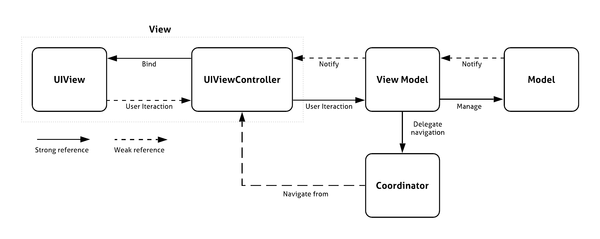
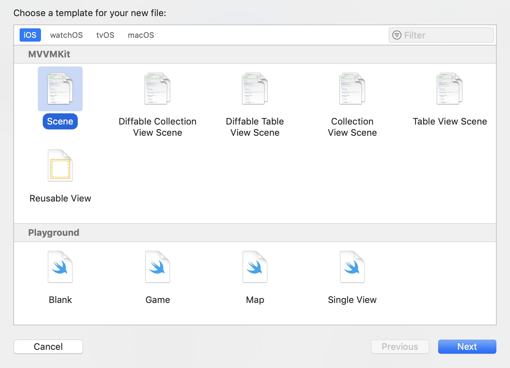

# MVVMKit

[](https://cocoapods.org/pods/MVVMKit)
[](https://cocoapods.org/pods/MVVMKit)
[](https://cocoapods.org/pods/MVVMKit)


**MVVMKit** is a protocol oriented library that defines a clear way to adopt the MVVM software architecture in your iOS application.
Optionally MVVMKit give you the possibility to take out the navigation responsibility from the view model and put it inside a `Coordinator` type.

- [Introduction](#introduction)
- [Templates](#templates)
- [Installation](#installation)

## Introduction

In general using MVVMKit most of your software types should belong to one of the following categories:

### Model

The actual data manipulated by your applications. 
Model type can be `NSManagedObject` fetched from a Core Data database or `Codable` instances coming from a web server.

Model’s responsibilities:
- Maintain the state of the application

### UIView

The user interface. On iOS views are typically subclasses of `UIView`.

UIView’s responsibilities:
- Show the application content
- Deliver the user interaction to a `UIViewController`

### UIViewController
A subclass of `UIViewController`

UIViewController’s responsibilities
- Deliver the user interaction to the View Model
- Bind the View Model to the view

Note: on iOS we divide the View entity of the MVVM pattern in two entities: `UIView` and `UIViewController`.

### View Model
The actual "brain" of a scene of your application.

View Model’s responsibilities:
- Manage the model
- Present the model in a way that is immediately suitable for the view
- Notify the view controller when it should update the view (a.k.a. make a bind)

### Coordinator
The entity responsible for the application navigation.

Coordinator’s Responsibilities
- Decide which is (and how to show) the next view controller 
- Instantiate view controllers and associated view models doing appropriate dependency injections

##

### Grapical representation



# Templates

Copy the `Templates/MVVMKit` folder into `~/Library/Developer/Xcode/Templates`.

The result should be the following:




## Installation

MVVMKit is available through [CocoaPods](https://cocoapods.org). To install
it, simply add the following line to your Podfile:

```ruby
pod 'MVVMKit'
```

MVVMKit is also available as a **Swift Package**.


### Example project

To run the example project, clone the repo, and run `pod install` inside the `Example` directory first.

## Author

[alfogrillo](https://github.com/alfogrillo)

## License

**MVVMKit** is available under the MIT license. See the LICENSE file for more info.

